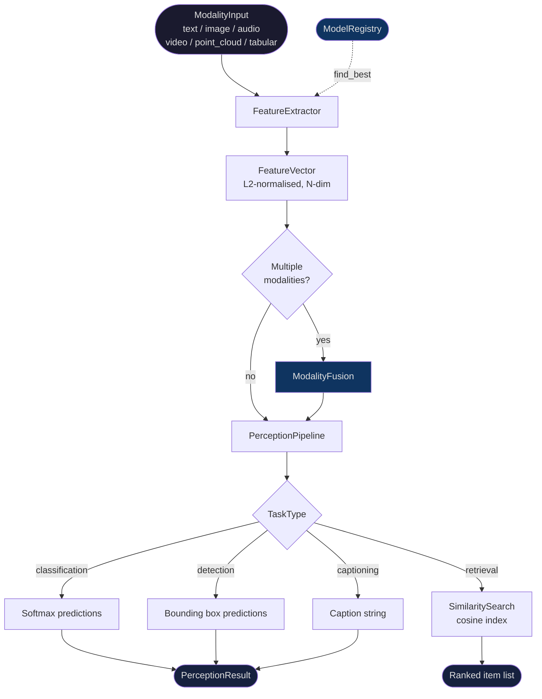

# aumai-omnipercept

**Multimodal perception framework for agentic AI systems.**

Part of the [AumAI](https://github.com/aumai) open-source infrastructure suite — 88 packages for production agentic AI.

---

## What Is This, In Plain English?

Imagine you are a detective at a crime scene. You read the witness statement (text), examine the photographs (images), listen to a recorded phone call (audio), and review surveillance footage (video). You do not analyse each piece of evidence in isolation. You combine them — weighing each against the others — and arrive at a single, confident conclusion.

`aumai-omnipercept` does exactly that for AI pipelines. It gives any agent a unified interface to:

1. Accept inputs from any combination of modalities — text, images, audio, video, 3D point clouds, tabular data
2. Extract a compact numeric feature vector from each input — a fixed-length array of floats that encodes "what matters" about that input
3. Fuse those vectors using one of four mathematically grounded strategies
4. Run a perception task (classification, detection, captioning, retrieval, question answering) over the fused representation
5. Return a structured, typed `PerceptionResult` with ranked predictions and confidence scores

The agent receives one object it can reason over — regardless of whether the source inputs were a sentence, a JPEG, a WAV file, or all three at once.

---

## Why First Principles

Most multi-modal libraries bolt modalities together as an afterthought: a text model here, a vision model there, glued with ad-hoc logic. `aumai-omnipercept` starts from a single invariant:

> Every signal, regardless of its physical form, can be faithfully represented as a fixed-length vector of floating-point numbers. The geometry of those vectors encodes semantic similarity.

This invariant lets the entire library be model-agnostic. The `ModelRegistry` holds `ModelCard` metadata. The `FeatureExtractor` asks the registry which model is best for a given modality/task pair, then delegates to it. Swap in a real CLIP embedding or a Whisper encoder by registering one `ModelCard` — nothing else changes.

The same invariant means cosine similarity works uniformly across modalities. A text vector and an image vector from the same concept will be closer to each other than either is to an unrelated concept, making cross-modal search a first-class feature.

---

## Architecture



### Component Map

| Component | Class | Responsibility |
|---|---|---|
| Input layer | `ModalityInput` | Typed, validated input for any modality |
| Model catalogue | `ModelRegistry` | Queryable registry of `ModelCard` entries |
| Feature extraction | `FeatureExtractor` | Converts any `ModalityInput` to a normalised `FeatureVector` |
| Multi-modal fusion | `ModalityFusion` | Combines N `FeatureVector` objects into one `FusedRepresentation` |
| Orchestration | `PerceptionPipeline` | Runs extract → fuse → predict for a configured `PipelineConfig` |
| Retrieval | `SimilaritySearch` | In-memory cosine similarity index |
| Evaluation | `Benchmarker` | Measures accuracy, precision, recall, F1, and latency |

---

## Features

- **Six modalities**: `text`, `image`, `audio`, `video`, `point_cloud`, `tabular`
- **Seven task types**: `classification`, `detection`, `segmentation`, `generation`, `retrieval`, `captioning`, `question_answering`
- **Four fusion strategies**: `early` (concat + stride-project), `late` (element-wise average), `cross_attention` (scaled dot-product), `weighted_sum` (L2-energy weighted)
- **12 built-in model cards** spanning text embedding, image detection/segmentation, audio classification, video captioning, 3D point cloud processing, and tabular encoding
- **Cosine similarity search** — in-memory index with O(n) linear scan; plug `FeatureVector.values` into any vector database for production scale
- **Macro precision / recall / F1 benchmarking** with per-sample latency tracking via `Benchmarker`
- **Full Pydantic v2 validation** on every input, output, and config
- **Deterministic feature extraction** — SHA-256-seeded vectors are reproducible; same input always yields the same vector, making unit tests trivial
- **Zero hard ML dependencies** — the built-in extractor needs no GPU; override `extract()` to plug in real models
- **Click CLI** with five sub-commands: `models`, `extract`, `fuse`, `perceive`, `search`

---

## Installation

```bash
pip install aumai-omnipercept
```

Python 3.11+ required.

---

## Quick Start: CLI

### List available models

```bash
omnipercept models
omnipercept models --modality image
omnipercept models --task classification
```

Sample output:

```
12 model(s) available:

  text-embed-v1
    TextEmbedder | text | retrieval
    Dim: 256 | Params: 22.0M
    Lightweight text embedding model for retrieval tasks.
```

### Extract a feature vector

```bash
omnipercept extract --data "The quick brown fox jumped" --modality text --dim 64
```

```
Feature Extraction: text
  Model: TextEmbedder
  Dimensions: 64
  Norm: 1.000000
  Time: 0.38 ms
  First 8 values: [0.2134, -0.0871, 0.1423, ...]
```

### Fuse multiple modalities

Create `inputs.json`:

```json
[
  {"modality": "text",  "data": "A red sports car racing on a track"},
  {"modality": "image", "data": "/images/car.jpg", "width": 1280, "height": 720, "channels": 3}
]
```

```bash
omnipercept fuse --input inputs.json --strategy cross_attention --dim 256
```

### Run a full perception pipeline

Create `pipeline.json`:

```json
{
  "name": "VehicleClassifier",
  "modalities": ["text", "image"],
  "task": "classification",
  "fusion_strategy": "cross_attention",
  "feature_dim": 256,
  "max_predictions": 5,
  "confidence_threshold": 0.05
}
```

```bash
omnipercept perceive --config pipeline.json --input inputs.json
```

### Similarity search

Create `items.json`:

```json
[
  {"id": "doc-001", "data": "Introduction to neural networks", "modality": "text"},
  {"id": "doc-002", "data": "Deep learning for computer vision", "modality": "text"},
  {"id": "doc-003", "data": "Audio signal processing basics",   "modality": "text"}
]
```

```bash
omnipercept search --query "machine learning fundamentals" --items items.json --top-k 3
```

---

## Quick Start: Python API

```python
from aumai_omnipercept import (
    FeatureExtractor, ModalityFusion, PerceptionPipeline,
    SimilaritySearch, Modality, ModalityInput,
    PipelineConfig, FusionStrategy, TaskType,
)

# 1. Extract a single feature vector
extractor = FeatureExtractor()
text_input = ModalityInput(modality=Modality.TEXT, data="Hello world")
vector = extractor.extract(text_input, target_dim=128)
print(vector.dimensions, vector.norm)  # 128  1.0

# 2. Fuse text + image
image_input = ModalityInput(
    modality=Modality.IMAGE, data="photo.jpg",
    width=1920, height=1080, channels=3,
)
image_vector = extractor.extract(image_input, target_dim=128)
fusion = ModalityFusion()
fused = fusion.fuse([vector, image_vector], FusionStrategy.CROSS_ATTENTION, target_dim=128)
print(fused.weights)          # {'text': 0.4821, 'image': 0.5179}

# 3. End-to-end pipeline
config = PipelineConfig(
    name="ContentClassifier",
    modalities=[Modality.TEXT, Modality.IMAGE],
    task=TaskType.CLASSIFICATION,
    fusion_strategy=FusionStrategy.LATE,
    feature_dim=256,
    max_predictions=3,
    confidence_threshold=0.05,
)
pipeline = PerceptionPipeline(config)
result = pipeline.process([text_input, image_input])
for pred in result.predictions:
    print(f"{pred.label}: {pred.confidence:.4f}")
```

---

## Full CLI Reference

### `omnipercept models`

List models in the built-in registry.

```
Options:
  --modality  [text|image|audio|video|point_cloud|tabular]
  --task      [classification|detection|segmentation|generation|
               retrieval|captioning|question_answering]
  --version   Show version and exit.
  --help      Show this message and exit.
```

### `omnipercept extract`

Extract a feature vector from a single input.

```
Options:
  --data TEXT      Input data: raw text, file path, or base64  [required]
  --modality TEXT  text|image|audio|video|point_cloud|tabular  [required]
  --dim INTEGER    Output vector length  [default: 256]
  --help
```

### `omnipercept fuse`

Fuse features from a JSON list of modality inputs.

```
Options:
  --input PATH     JSON file: list of ModalityInput objects  [required]
  --strategy TEXT  early|late|cross_attention|weighted_sum   [default: late]
  --dim INTEGER    Output vector length  [default: 256]
  --help
```

Input JSON shape:

```json
[
  {
    "modality": "text",
    "data": "string",
    "metadata": {},
    "sample_rate": 0,
    "width": 0, "height": 0, "channels": 0,
    "duration_seconds": 0.0
  }
]
```

### `omnipercept perceive`

Run a full perception pipeline from JSON config and inputs.

```
Options:
  --config PATH   PipelineConfig JSON  [required]
  --input PATH    List of ModalityInput JSON  [required]
  --help
```

Config JSON shape:

```json
{
  "name": "string",
  "modalities": ["text", "image"],
  "task": "classification",
  "fusion_strategy": "late",
  "feature_dim": 256,
  "max_predictions": 10,
  "confidence_threshold": 0.5
}
```

### `omnipercept search`

Cosine similarity search over a JSON item corpus.

```
Options:
  --query TEXT     Query string (text modality)  [required]
  --items PATH     JSON: list of {id, data, modality}  [required]
  --top-k INTEGER  Number of results  [default: 5]
  --help
```

---

## Python API Examples

### Register a custom model

```python
from aumai_omnipercept import ModelRegistry, ModelCard, Modality, TaskType

registry = ModelRegistry()
registry.register(ModelCard(
    model_id="clip-vit-large-v1",
    name="CLIPViTLarge",
    modality=Modality.IMAGE,
    task=TaskType.RETRIEVAL,
    feature_dim=1024,
    parameters_millions=427.0,
    description="OpenAI CLIP ViT-Large/14 fine-tuned on product catalog.",
    supported_formats=["jpg", "png", "webp"],
))
best = registry.find_best(Modality.IMAGE, TaskType.RETRIEVAL)
print(best.model_id)   # clip-vit-large-v1  (highest feature_dim wins)
```

### Benchmark a pipeline

```python
from aumai_omnipercept import Benchmarker, PerceptionPipeline, PipelineConfig
from aumai_omnipercept import Modality, TaskType, FusionStrategy, ModalityInput

config = PipelineConfig(
    name="AudioClassifier",
    modalities=[Modality.AUDIO],
    task=TaskType.CLASSIFICATION,
    feature_dim=128,
    max_predictions=5,
    confidence_threshold=0.0,
)
pipeline = PerceptionPipeline(config)

test_inputs = [
    [ModalityInput(modality=Modality.AUDIO, data="audio1.wav",
                   sample_rate=16000, duration_seconds=3.0)],
    [ModalityInput(modality=Modality.AUDIO, data="audio2.wav",
                   sample_rate=22050, duration_seconds=5.5)],
]
ground_truth = ["class_0", "class_1"]

result = Benchmarker().evaluate(pipeline, test_inputs, ground_truth, "MyDataset")
print(f"Accuracy: {result.accuracy:.2%}")
print(f"F1:       {result.f1_score:.4f}")
print(f"Latency:  {result.avg_latency_ms:.2f} ms/sample")
```

### Object detection with bounding boxes

```python
from aumai_omnipercept import PerceptionPipeline, PipelineConfig, ModalityInput
from aumai_omnipercept import Modality, TaskType, FusionStrategy

config = PipelineConfig(
    name="ObjectDetector",
    modalities=[Modality.IMAGE],
    task=TaskType.DETECTION,
    feature_dim=256,
    max_predictions=10,
    confidence_threshold=0.3,
)
pipeline = PerceptionPipeline(config)
result = pipeline.process([
    ModalityInput(modality=Modality.IMAGE, data="scene.jpg",
                  width=1280, height=720, channels=3)
])
for pred in result.predictions:
    if pred.bbox:
        x1, y1, x2, y2 = pred.bbox
        print(f"{pred.label}: conf={pred.confidence:.3f} "
              f"bbox=[{x1:.3f},{y1:.3f},{x2:.3f},{y2:.3f}]")
```

### Build a similarity search index

```python
from aumai_omnipercept import FeatureExtractor, SimilaritySearch, Modality, ModalityInput

extractor = FeatureExtractor()
index = SimilaritySearch()

corpus = [
    ("art-backprop",    "Introduction to neural networks and backpropagation"),
    ("art-attention",   "Attention is all you need — transformer architecture"),
    ("art-rl",          "Reinforcement learning and policy gradient methods"),
    ("art-cv",          "Convolutional neural networks for image recognition"),
]
for item_id, text in corpus:
    fv = extractor.extract(ModalityInput(modality=Modality.TEXT, data=text))
    index.add(item_id, fv)

query_fv = extractor.extract(ModalityInput(modality=Modality.TEXT,
                                            data="deep learning for vision tasks"))
for item_id, score in index.search(query_fv, top_k=3):
    print(f"  {item_id}: {score:.6f}")
```

---

## Technical Deep-Dive

### Feature Extraction

`FeatureExtractor.extract()` produces a deterministic, L2-normalised vector in four steps:

1. **Seed**: SHA-256 of `"{modality}:{data}"` — identical inputs always produce identical vectors.
2. **Unrolling**: the seed is iteratively re-hashed; each 4-byte chunk maps to `[-1, 1]` via `raw / 2^31 - 1`. This continues until `target_dim` values are ready.
3. **Modality modulation**: first few dimensions are overwritten with tanh-scaled statistics that reflect real semantic properties — word count / character count for text, pixel dimensions for images, sample rate / duration for audio.
4. **L2 normalisation**: divide by the Euclidean norm. All vectors live on the unit hypersphere; cosine similarity equals dot product.

### Fusion Strategies

| Strategy | Algorithm | Complexity | Best For |
|---|---|---|---|
| `EARLY` | Concatenate all vectors; stride-sample to `target_dim` | O(sum_dims + target_dim) | Tightly coupled modalities |
| `LATE` | Pad to `target_dim`, element-wise average | O(N * target_dim) | Loosely independent modalities |
| `CROSS_ATTENTION` | Each modality attends to all others via softmax(dot/sqrt(dim)) | O(N^2 * target_dim) | Cross-modal relationship tasks |
| `WEIGHTED_SUM` | Weight each modality by L2 energy (norm^2) | O(N * target_dim) | Mixed-quality modality inputs |

### Prediction Generation

- **Classification**: first `max_predictions` feature values treated as logits; softmax applied; predictions above `confidence_threshold` returned, sorted descending.
- **Detection**: features consumed in 6-value chunks `(x1, y1, w, h, class_idx, conf)` — bounding boxes normalised to `[0, 1]`.
- **Captioning**: single `Prediction` whose `label` encodes modality names and feature energy statistics.
- **Other tasks** fall back to classification-style output.

### Modality Weights in Fused Representations

`FusedRepresentation.weights` records each modality's fractional energy contribution (a value between 0 and 1 that sums to 1 across all modalities). If `image: 0.72, text: 0.28`, the image dominated. Use this for debugging and interpretability.

---

## Integration Table

| Use Case | Key Classes | Notes |
|---|---|---|
| Text semantic search | `FeatureExtractor`, `SimilaritySearch` | `Modality.TEXT`, cosine similarity |
| Image classification | `PerceptionPipeline` | `TaskType.CLASSIFICATION`, `Modality.IMAGE` |
| Audio event detection | `PerceptionPipeline` | Set `sample_rate` and `duration_seconds` in `ModalityInput` |
| Multimodal RAG | `FeatureExtractor`, `SimilaritySearch` | Index text + image vectors together |
| Pipeline evaluation | `Benchmarker` | Returns macro precision/recall/F1 + per-sample latency |
| Custom model plug-in | `ModelRegistry.register()` | Register a `ModelCard`; `find_best` selects by `feature_dim` |
| Fusion ablation study | `ModalityFusion` | Compare all four strategies on the same feature set |
| Video understanding | `PerceptionPipeline` | `Modality.VIDEO`, `TaskType.CAPTIONING` |
| 3D point cloud | `PerceptionPipeline` | `Modality.POINT_CLOUD`, formats: ply/pcd/xyz |

---

## Built-In Model Registry

| Model ID | Name | Modality | Task | Dim | Params (M) |
|---|---|---|---|---|---|
| `text-embed-v1` | TextEmbedder | text | retrieval | 256 | 22.0 |
| `text-classify-v1` | TextClassifier | text | classification | 128 | 15.0 |
| `image-embed-v1` | ImageEmbedder | image | retrieval | 512 | 86.0 |
| `image-detect-v1` | ObjectDetector | image | detection | 256 | 41.0 |
| `image-segment-v1` | SegmentAnything | image | segmentation | 256 | 93.0 |
| `audio-embed-v1` | AudioEmbedder | audio | retrieval | 256 | 12.0 |
| `audio-classify-v1` | AudioClassifier | audio | classification | 128 | 8.0 |
| `video-embed-v1` | VideoEmbedder | video | retrieval | 512 | 150.0 |
| `video-caption-v1` | VideoCaptioner | video | captioning | 512 | 200.0 |
| `multimodal-qa-v1` | MultimodalQA | text | question_answering | 768 | 350.0 |
| `pointcloud-v1` | PointCloudNet | point_cloud | classification | 256 | 5.0 |
| `tabular-v1` | TabularEncoder | tabular | classification | 64 | 0.5 |

---

## Disclaimer

The built-in `FeatureExtractor` uses deterministic hash-based simulation rather than real ML model inference. This provides a consistent, reproducible API for building and testing multimodal perception pipelines without GPU hardware or weight downloads. To use real model inference, subclass `FeatureExtractor` and override `extract()` with calls to your preferred backend (ONNX Runtime, TensorRT, Hugging Face Transformers, CoreML, etc.).

---

## License

Apache 2.0. See [LICENSE](LICENSE).

## Contributing

See [CONTRIBUTING.md](CONTRIBUTING.md).
